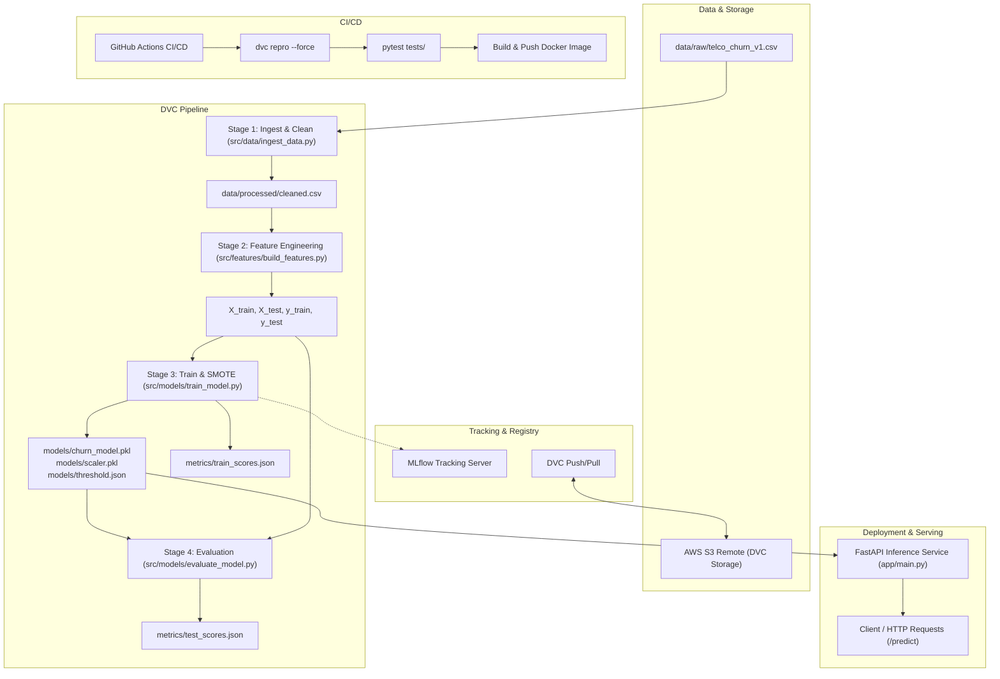

# 🚀 Customer Churn MLOps Pipeline

[](https://www.python.org/)
[](https://fastapi.tiangolo.com/)
[](https://dvc.org/)
[](https://mlflow.org/)
[](https://www.docker.com/)
[](https://github.com/features/actions)

An end-to-end, production-grade Machine Learning Operations (MLOps) pipeline for predicting customer churn using the Telco Customer Churn dataset. This project demonstrates automated data versioning, modular reproducible pipelines, experiment tracking, class imbalance handling, REST API model serving, containerization, and continuous integration / continuous deployment (CI/CD).

---

## 📌 Table of Contents

- [Architecture Overview](#-architecture-overview)
- [Project Structure](#-project-structure)
- [Key Features & Tech Stack](#-key-features--tech-stack)
- [Installation & Setup](#-installation--setup)
- [ML Pipeline (DVC)](#-ml-pipeline-dvc)
- [Experiment Tracking (MLflow)](#-experiment-tracking-mlflow)
- [Serving with FastAPI](#-serving-with-fastapi)
- [Docker & Docker Compose](#-docker--docker-compose)
- [Testing](#-testing)
- [CI/CD Workflow](#-cicd-workflow)
- [Configuration & Environment Variables](#-configuration--environment-variables)

---

## 🏗 Architecture Overview



---

## 📂 Project Structure

```text
customer-churn-mlops-pipeline/
├── .dvc/                             # DVC internal configuration & cache
│   └── config                        # S3 remote storage configuration
├── .github/
│   └── workflows/
│       └── mlops.yml                 # GitHub Actions CI/CD pipeline
├── app/                              # FastAPI REST API serving
│   ├── __init__.py
│   ├── main.py                       # FastAPI application & /predict endpoint
│   ├── model_loader.py               # Safe loader for model, scaler & thresholds
│   └── schemas.py                    # Pydantic schemas for request validation
├── data/
│   ├── raw/
│   │   ├── telco_churn_v1.csv        # Raw dataset
│   │   └── telco_churn_v1.csv.dvc    # DVC tracking pointer
│   └── processed/                    # Cleaned & transformed feature sets
├── metrics/
│   ├── train_scores.json             # Training metrics (Accuracy, F1, ROC-AUC)
│   └── test_scores.json              # Test evaluation metrics & confusion matrix
├── models/
│   ├── churn_model.pkl               # Serialized trained model
│   ├── scaler.pkl                    # StandardScaler instance
│   ├── threshold.json                # Optimal classification decision threshold
│   └── feature_names.json            # Reference feature columns for inference alignment
├── notebooks/
│   └── 01_eda.ipynb                  # Exploratory Data Analysis & experimentation
├── src/                              # Modular pipeline source code
│   ├── data/
│   │   └── ingest_data.py            # Data loading, cleaning & type coercion
│   ├── features/
│   │   └── build_features.py         # One-hot encoding, scaling & train-test split
│   └── models/
│       ├── train_model.py            # SMOTE resampling, Random Forest training & MLflow logging
│       └── evaluate_model.py         # Test set evaluation & confusion matrix generation
├── tests/                            # Automated test suite
│   ├── test_features.py              # Tests for preprocessing logic
│   ├── test_inference.py             # Integration tests for FastAPI endpoints
│   └── test_model.py                 # Tests for model artifacts & predictions
├── Dockerfile                        # Docker image definition for FastAPI app
├── docker-compose.yml                # Multi-container orchestration (API + MLflow)
├── dvc.yaml                          # DVC multi-stage pipeline definition
├── dvc.lock                          # DVC pipeline dependency lockfile
├── requirements.txt                  # Python production dependencies
└── README.md                         # Project documentation
```

---

## ⚡ Key Features & Tech Stack

| Component | Technology | Description |
| :--- | :--- | :--- |
| **Data Versioning** | [DVC](https://dvc.org/) | Versions raw/processed data and models backed by AWS S3. |
| **Pipeline Orchestration** | [DVC Pipelines](https://dvc.org/doc/user-guide/pipelines) | Reproducible stages (`ingest` ➔ `features` ➔ `train` ➔ `evaluate`). |
| **Experiment Tracking** | [MLflow](https://mlflow.org/) | Logs parameters, metrics (Accuracy, F1, ROC-AUC), and model artifacts. |
| **Modeling** | [scikit-learn](https://scikit-learn.org/), [imbalanced-learn](https://imbalanced-learn.org/) | Random Forest Classifier with SMOTE oversampling for class balance. |
| **Model Serving** | [FastAPI](https://fastapi.tiangolo.com/), [Uvicorn](https://www.uvicorn.org/) | Low-latency REST API with automated validation and Swagger UI (`/docs`). |
| **Containerization** | [Docker](https://www.docker.com/), [Docker Compose](https://docs.docker.com/compose/) | Isolated and reproducible container environments for API and MLflow. |
| **Testing** | [pytest](https://docs.pytest.org/), [httpx](https://www.python-httpx.org/) | Unit tests and API contract tests. |
| **CI/CD** | [GitHub Actions](https://github.com/features/actions) | Automated linting, test execution, DVC reproduction, and Docker Hub deployment. |

---

## 🛠 Installation & Setup

### 1. Prerequisites
- Python `3.10`
- Git & DVC
- Docker & Docker Compose (optional, for containerized run)

### 2. Clone Repository & Create Virtual Environment

```bash
git clone https://github.com/2022bcs0044-hadiq/customer-churn-mlops-pipeline.git
cd customer-churn-mlops-pipeline

# Create virtual environment
python -m venv venv

# Activate virtual environment
# Windows (PowerShell):
.\venv\Scripts\Activate.ps1
# Linux/macOS:
source venv/bin/activate
```

### 3. Install Dependencies

```bash
pip install --upgrade pip
pip install -r requirements.txt
```

---

## 🔄 ML Pipeline (DVC)

The entire machine learning workflow is orchestrated via `dvc.yaml`:

1. **Ingest** (`src/data/ingest_data.py`):
   - Coerces `TotalCharges` to numeric and drops rows with missing values.
   - Drops non-predictive identifiers (`customerID`).
   - Converts binary categorical fields (`Partner`, `Dependents`, `PhoneService`, `PaperlessBilling`, `Churn`) into `0/1`.
2. **Features** (`src/features/build_features.py`):
   - Applies one-hot encoding across remaining categorical variables.
   - Applies standard scaling.
   - Splits data into 80% train and 20% test sets.
3. **Train** (`src/models/train_model.py`):
   - Saves feature column names to `models/feature_names.json`.
   - Addresses target imbalance using **SMOTE** (Synthetic Minority Over-sampling Technique).
   - Trains a `RandomForestClassifier` (`n_estimators=200`, `max_depth=6`).
   - Logs metrics and artifacts into MLflow.
   - Exports serialized models: `churn_model.pkl`, `scaler.pkl`, and `threshold.json`.
4. **Evaluate** (`src/models/evaluate_model.py`):
   - Generates predictions on the held-out test set.
   - Computes Accuracy, F1-Score, ROC-AUC, and Confusion Matrix into `metrics/test_scores.json`.

### Run the Pipeline

```bash
# Execute all stages sequentially (only runs modified stages)
dvc repro

# Force execution of all stages
dvc repro --force

# Inspect tracked metrics
dvc metrics show
```

### DVC Remote Storage (AWS S3)

To synchronize data and artifacts with the configured AWS S3 remote:

```bash
# Pull data from S3 remote
dvc pull

# Push newly produced data/model versions to S3
dvc push
```

---

## 📊 Experiment Tracking (MLflow)

MLflow tracks all training runs under the `customer-churn` experiment.

### Start MLflow Tracking Server

```bash
mlflow ui --host 0.0.0.0 --port 5000
```
Open [http://localhost:5000](http://localhost:5000) in your browser to inspect parameters, metrics charts, and artifact files.

---

## 🌐 Serving with FastAPI

The REST API serves real-time churn predictions with automatic schema validation and feature alignment.

### Start the API Locally

```bash
uvicorn app.main:app --host 0.0.0.0 --port 8000 --reload
```

- **Interactive API Documentation (Swagger)**: [http://localhost:8000/docs](http://localhost:8000/docs)
- **Alternative Documentation (ReDoc)**: [http://localhost:8000/redoc](http://localhost:8000/redoc)

### API Endpoints

#### 1. Health Check
- **Endpoint**: `GET /`
- **Response**:
```json
{
  "message": "Customer Churn Prediction API is running"
}
```

#### 2. Make Prediction
- **Endpoint**: `POST /predict`
- **Headers**: `Content-Type: application/json`
- **Request Body**:
```json
{
  "gender": 1,
  "SeniorCitizen": 0,
  "Partner": 0,
  "Dependents": 0,
  "tenure": 12,
  "PhoneService": 1,
  "PaperlessBilling": 1,
  "MonthlyCharges": 65.5,
  "TotalCharges": 786.0
}
```
- **Response**:
```json
{
  "churn_probability": 0.3245,
  "prediction": 0
}
```
*(Where `prediction = 1` indicates predicted churn, and `prediction = 0` indicates retention based on the learned threshold)*.

---

## 🐳 Docker & Docker Compose

### Option A: Run FastAPI with Docker

```bash
# Build Docker image
docker build -t churn-mlops-api .

# Run container
docker run -p 8000:8000 churn-mlops-api
```

### Option B: Run Full Stack with Docker Compose (API + MLflow)

```bash
docker-compose up --build -d
```

- **FastAPI API**: [http://localhost:8000/docs](http://localhost:8000/docs)
- **MLflow Dashboard**: [http://localhost:5000](http://localhost:5000)

To stop services:
```bash
docker-compose down
```

---

## 🧪 Testing

The repository uses `pytest` to run unit and integration tests.

```bash
# Run all tests
PYTHONPATH=. pytest tests/ -v

# Run with test coverage
PYTHONPATH=. pytest tests/ --cov=app --cov=src
```

Tests include:
- `tests/test_inference.py`: Validates API endpoints `/` and `/predict`, testing payload compatibility and prediction outputs.
- `tests/test_features.py`: Validates data transformations and feature preparation.
- `tests/test_model.py`: Validates model artifact shapes and outputs.

---

## 🔄 CI/CD Workflow

The GitHub Actions workflow defined in [`.github/workflows/mlops.yml`](.github/workflows/mlops.yml) triggers on every push to the `main` branch:

1. **Environment Setup**: Provisions Ubuntu runner with Python `3.10`.
2. **Dependency Installation**: Installs wheel, requirements, and DVC dependencies.
3. **AWS Authentication**: Authenticates with AWS using GitHub Secrets to connect to S3.
4. **Pipeline Execution**: Executes `dvc repro --force` to train and evaluate the model.
5. **Automated Testing**: Runs `pytest tests/ -v`.
6. **Metrics Step Summary**: Summarizes `metrics/train_scores.json` and `metrics/test_scores.json` directly onto the GitHub Actions run summary.
7. **Artifact Archiving**: Uploads the `metrics/` folder as a workflow artifact.
8. **Docker Image Build & Push**: Builds the container image and pushes it to DockerHub as `2022bcs0044hadiqc/churn-mlops`.

### Required GitHub Secrets

To enable CI/CD deployment, configure the following secrets under **Settings > Secrets and variables > Actions**:

| Secret Name | Description |
| :--- | :--- |
| `AWS_ACCESS_KEY_ID` | AWS IAM Access Key ID for DVC S3 bucket access |
| `AWS_SECRET_ACCESS_KEY` | AWS IAM Secret Access Key |
| `AWS_SESSION_TOKEN` | (Optional) AWS Session Token if using temporary credentials (e.g. AWS Academy) |
| `DOCKERHUB_USERNAME` | DockerHub username for publishing images |
| `DOCKERHUB_TOKEN` | DockerHub Personal Access Token (PAT) |

---

## 📄 License

This project is licensed under the MIT License - see the LICENSE file for details.
